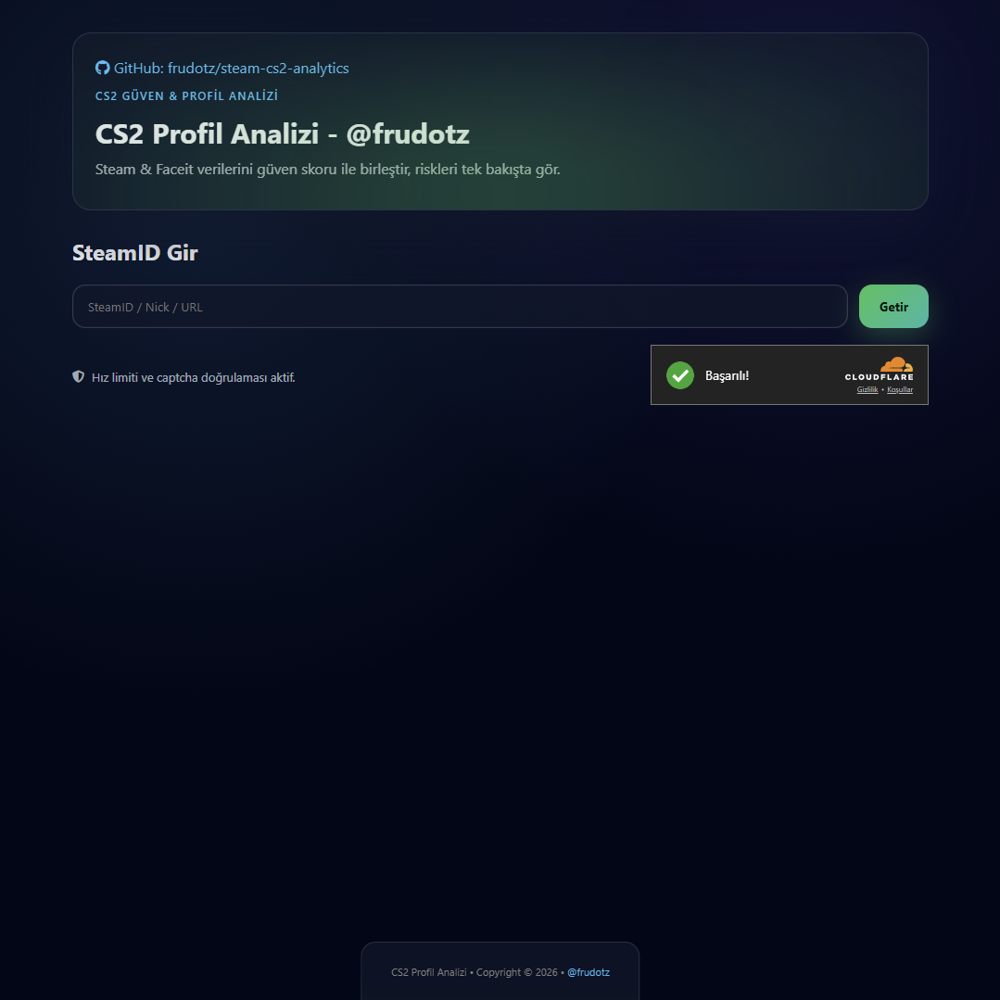
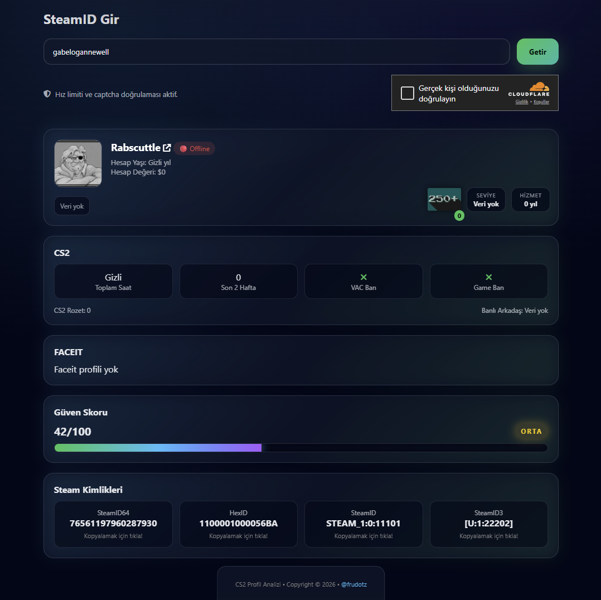
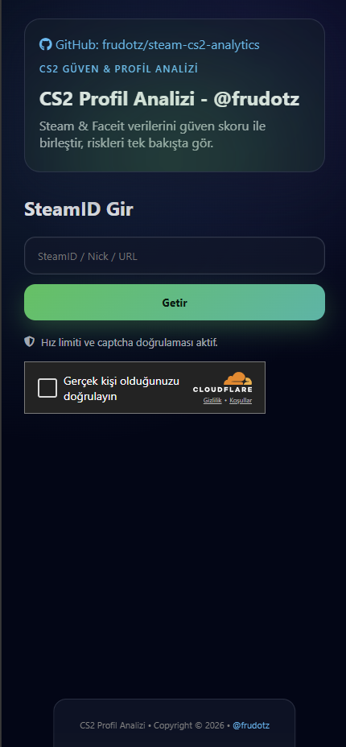
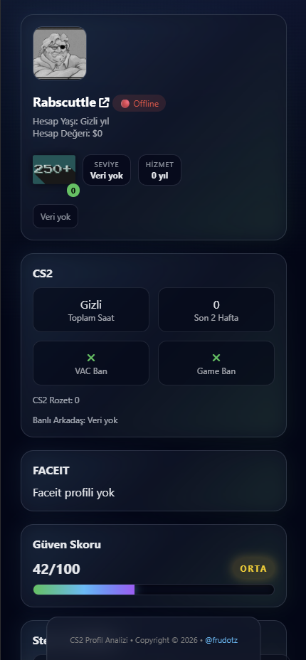

# 🧠 CS2 Güven & Profil Analizi

Bu proje, bir **vibe coding** çalışması olarak ortaya çıkmıştır.  
Geliştirme sürecinde fikir üretimi, mimari tartışmalar ve problem çözme aşamalarında **ChatGPT 5.2**’den aktif olarak faydalanılmıştır.

Ama ortaya çıkan şey bir “demo” değil;  
**gerçek kullanım senaryoları gözetilerek**, abuse’a açık noktaları özellikle kapatılmaya çalışılmış,  
okuyan kişinin “bu niye böyle yapılmış?” sorusuna cevap verebilen bir sistemdir.

## 🎯 Projenin Amacı

Bu proje, bir Steam hesabını **CS2 özelinde** değerlendirerek:

- “Bu hesap %100 güvenilir mi?” gibi iddialı ve yanlış bir soruya değil  
- **“Bu hesap ne kadar güvenilir görünüyor?”** sorusuna

çoklu sinyaller üzerinden **tek bir güven skoru** ile cevap üretmeyi hedefler.

Amaç:
- Tek bir metrikten karar vermemek  
- Yeni ama aktif hesapları otomatik olarak cezalandırmamak  
- Hesap davranışını, olgunluğunu ve geçmişini **dengeleyerek** yorumlamak  

## 🧱 Genel Mimari

```

Frontend (cs2.frudotz.com)
│
│ fetch + credentials
│
Cloudflare Access (Auth)
│
│
Cloudflare Worker (API)
│
├─ Origin Allowlist (CORS)
├─ Rate Limit
├─ Cloudflare Turnstile (Captcha)
├─ Steam Web API
└─ FACEIT API (opsiyonel)

```

Bu yapı:
- Sunucusuz
- Global
- Ölçeklenebilir
- Abuse’a karşı katmanlı korumaya sahip

## 🔐 Güvenlik Yaklaşımı

Bu API **tek bir güvenlik önlemine dayanmaz**.

Uygulanan katmanlar:

- **Cloudflare Access**  
  API doğrudan internete açık değildir. Access’ten geçmeyen istek Worker’a ulaşmaz.

- **CORS Origin Allowlist**  
  Sadece izin verilen frontend origin’lerinden gelen istekler kabul edilir.

- **Cloudflare Turnstile**  
  Bot, script ve otomatik abuse girişimleri için captcha doğrulaması zorunludur.

- **Rate Limit**  
  IP bazlı istek sınırı ile flood ve brute-force denemeleri engellenir.

- **workers.dev kapalı**  
  Worker sadece özel domain üzerinden erişilebilir, bypass yolu yoktur.

Sonuç olarak:
- Frontend üzerinden sorunsuz çalışır  
- Harici denemelerde anlamlı veri üretmez  

## 📊 Güven Skoru Nasıl Hesaplanır?

Güven skoru **tek bir kriterle** belirlenmez.  
Her sinyalin etkisi **ağırlıklı ve sınırlıdır**.

### Kullanılan Ana Sinyaller ve Çarpanlar

Aşağıdaki oranlar **bilinçli olarak açık bırakılmıştır**.  
Bu bir kara kutu değildir.

```

Güven Skoru =

(Hesap Yaşı            × 0.20)

* (Sahip Olunan Oyun   × 0.15)
* (Toplam Oyun Saati   × 0.15)
* (Rozet Sayısı        × 0.10)
* (VAC / Game Ban Yok  × 0.30)
* (FACEIT Katkısı      × 0.10)

```

> Notlar:
> - FACEIT profili **yoksa** bu kısım 0 kabul edilir, negatif etki yaratmaz  
> - VAC / Game Ban varsa bu katkı **tamamen sıfırlanır**  
> - Hiçbir kriter tek başına skoru domine edemez  

## 🧮 Örnek Hesaplama

Örnek bir Steam hesabı için varsayımsal veriler:

- Hesap yaşı: **6 yıl**
- Sahip olunan oyun: **120**
- Toplam oyun süresi: **1.400 saat**
- Rozet sayısı: **10**
- VAC / Game ban: **Yok**
- FACEIT profili: **Var (ortalama ELO)**

Basitleştirilmiş hesap:

```

6   × 0.20 = 1.20
120 × 0.15 = 18.00
1400× 0.15 = 210.00
10  × 0.10 = 1.00
Ban yok     = 30.00
FACEIT     = 10.00
------------------

Toplam ≈ 270.2

````

Bu ham skor:
- normalize edilir
- üst / alt sınırlarla dengelenir
- son kullanıcıya **yorumlanabilir** bir değer olarak sunulur

Amaç:
> “Bu hesap kesin temiz” demek değil,  
> **risk profilini sayısal olarak ifade etmek**.

## 🖼️ Arayüz & Görseller

Projeyi kullananlar için arayüz örnekleri aşağıdaki gibi eklenebilir.

### 🖥️ Masaüstü

<p align="left">
  
  
  
  
</p>

## ⚙️ Kurulum (Kendi Ortamınızda)

Bu projeyi kullanmak için **kendi alan adınız ve kendi API anahtarlarınız** ile kurulum yapmanız gerekir.

### Gereksinimler

* Cloudflare hesabı
* Cloudflare Workers
* Cloudflare Access
* Cloudflare Turnstile
* Steam Web API Key
* (Opsiyonel) FACEIT API Key
* Node.js 18+

### Genel Kurulum Adımları

1. Projeyi fork’layın veya klonlayın
2. Cloudflare Worker oluşturun
3. Gerekli environment variable’ları tanımlayın
4. Worker’ı kendi domain’inize bağlayın
5. Access ve CORS ayarlarını kendi frontend’inize göre yapılandırın
6. Frontend tarafında `credentials: include` ile çağırın

Bu repo **örnek bir servis adresi dağıtmaz**.  
Her kurulum **kullanıcının kendi altyapısı** üzerinden yapılmalıdır.

# 📝 Lisans & Sorumluluk Reddi

- 🫷 **Sorumluluk Reddi**
  - Bu proje **istatistiksel bir güven değerlendirmesi** için ücretsiz olarak sunulur.  
  - Geliştirme aşamasında umuma açık kaynaklardan, ücretsiz API'lardan ve yapay zekadan faydalanılmış olup,  
  - Veri sağlayıcılara ait, dışa kapalı ya da ücretli herhangi bir kaynak suistimal edilmemiştir.   

- ℹ️ **Lisans Bilgilendirmesi**
  - Projeye ait tüm kodlar ve projenin kendisi **GPL-3.0** kapsamında lisanslanmıştır.  
  - Bu yazılım **herhangi bir ücrete tabi olmaksızın** kullanılabilir, incelenebilir, değiştirilebilir/geliştirilebilir, dağıtılabilir.  
  - Dağıtılan tüm kopyalar ve türev çalışmalar **GPL-3.0 kullanım şartları** kapsamında aynı lisans altında kalmalı,  
  - Kaynak kodları erişilebilir olmalı ve tarafıma ait **telif/lisans eklentileri (@frudotz) korunmalıdır.**  
  - Lisansa dair tüm bilgiler için: [LICENSE dosyası.](https://github.com/frudotz/steam-cs2-analytics/blob/main/LICENSE)  

*Son karar her zaman kullanıcıya veya sistemi kullanan platforma aittir.*

# 🤝 Katkıda Bulun / Bağış

- Hataları **Issue** açarak bildirebilirsiniz  
- Geliştirmeler için **Pull Request** gönderebilirsiniz  
- Rehberi faydalı bulduysanız [🍻 bir bira ısmarlayarak](https://coff.ee/frudotz) destek olabilirsiniz  

-----------
🎀 Vakit ayırdığınız için teşekkür ederiz!  
✨ İçeriği faydalı bulduysanız **⭐ Star** vermeyi unutmayın.
